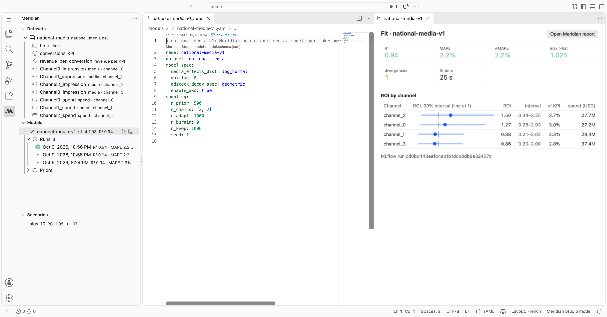
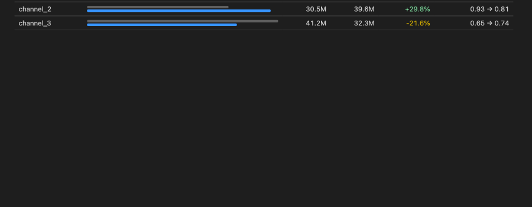

# Meridian Studio

[](https://github.com/lgrosjean/meridian-studio/actions/workflows/test.yml)
[](https://marketplace.visualstudio.com/items?itemName=lgrosjean.meridian-studio)

> **Unofficial community project.** Not affiliated with, endorsed by or sponsored by Google.
> Meridian and the Meridian logo are trademarks of Google LLC. Google's own product named Meridian Studio
> is at https://developers.google.com/meridian/studio; this extension is unrelated.

Marketing mix models as code. Run [Google Meridian](https://github.com/google/meridian) from VS Code or Cursor:
datasets, models and budget scenarios are YAML files in your repo, fitted and optimized from the sidebar, tracked
in MLflow.





## Getting started

1. Open a folder. Click the Meridian icon in the activity bar, then **New dataset** and pick your weekly CSV.
   The YAML opens filled from the CSV as far as its content and column names allow; what is left, complete it in
   the YAML (the CSV's columns are offered where they go) or set roles from the tree.
2. **New model** on that dataset: `ModelSpec`, priors, sampling. Click **▶ Fit** above the file.
3. **New scenario** on that model: a budget, bounds per channel. Click **▶ Optimize**.

The first run installs what it needs: [uv](https://docs.astral.sh/uv/) if missing (after asking; into the
extension's own storage, no PATH change), then Python and Meridian (a few minutes and about 1 GB, once).
Fits run on your machine, on CPU.

## What it does

| Sidebar   | Folder       | The YAML says                                                  | ▶ runs                                   |
|-----------|--------------|----------------------------------------------------------------|------------------------------------------|
| Datasets  | `datasets/`  | a CSV and how Meridian reads it (`CsvDataLoader`'s arguments)  | nothing: a fit reads the CSV             |
| Models    | `models/`    | the dataset, `ModelSpec`, priors, sampling                     | the fit, logged to MLflow                |
| Scenarios | `scenarios/` | the model, a budget, bounds per channel, or an ROI target      | Meridian's `BudgetOptimizer` on that fit |

- **Completion and errors while you type**, from a JSON schema per kind (through the YAML extension, installed
  with this one), and for a dataset from its CSV (below). Columns named in a dataset but absent from its CSV show
  in red in the tree.
- **The tree explains each file**: a dataset unfolds into its CSV columns and their roles, unused ones greyed;
  a model into its priors per channel and its runs.
- **Results beside the editor** after each run: R², MAPE, r-hat, divergences, ROI by channel with its interval;
  or a scenario's spend before and after. Meridian's own HTML report opens in the editor too (its charts load
  Vega from gstatic.com, so they need the network).
- **History**: every fit appends a line to `<model>.runs.jsonl` (when, the configuration, what it found), listed
  under the model; click one to see its results again.
- **Outdated runs** are flagged when a YAML or its CSV changed since. Rename and delete carry a file's run
  records along and update the files that name it.

A dataset, for example:

```yaml
name: synthetic
csv: data/national_media.csv
kpi_type: non_revenue
coord_to_columns:
  time: time
  kpi: conversions
  revenue_per_kpi: revenue_per_conversion
  controls: [competitor_activity_score_control, sentiment_score_control]
  media: [Channel0_impression, Channel1_impression]
  media_spend: [Channel0_spend, Channel1_spend]
media_to_channel: { Channel0_impression: ch0, Channel1_impression: ch1 }
media_spend_to_channel: { Channel0_spend: ch0, Channel1_spend: ch1 }
```

A model's priors are Meridian's [`PriorDistribution`](https://developers.google.com/meridian/reference/api/meridian/model/prior_distribution/PriorDistribution)
fields, each one TensorFlow Probability distribution. Its arguments go once for every channel, or per channel
with a `default`; a LogNormal also takes `mean` and `sd` in its own units (an ROI of 1.2 ± 0.6). Fields left
out keep Meridian's defaults; completion lists all of them, with what each one is.

```yaml
priors:
  roi_m:                    # used when model_spec.media_prior_type is roi (the default)
    dist: LogNormal
    default: { mean: 1.0, sd: 1.0 }
    tv: { mean: 1.5, sd: 0.8 }
  alpha_m:                  # adstock decay
    dist: Beta
    default: { concentration1: 1, concentration0: 1 }
    tv: { concentration1: 6, concentration0: 4 }
  ec_m: { dist: TruncatedNormal, loc: 0.8, scale: 0.8, low: 0.1, high: 10 }
  sigma: { dist: HalfNormal, scale: 3 }
```

## Datasets, from their CSV

- **New dataset fills the YAML from the CSV**: the column of dates becomes `time`, the column repeating them `geo`;
  a channel's impressions pair with its spend by name (`tv_imps` and `tv_spend` make channel `tv`; reach, frequency
  and spend likewise); the KPI, revenue per KPI and controls come by name. A column it cannot place stays unused,
  greyed in the tree. **Complete from \<csv\>**, above the file, does it again, after the CSV gains columns say.
- **The CSV's columns complete where they go**: under `coord_to_columns`, the columns no role holds yet, likeliest
  first (dates for `time`, numbers named like spend for `media_spend`…), each with what it holds
  (`numbers · 32.5K – 338K · 3 zeros`); in a `*_to_channel` map, the role's columns not mapped yet, all at once if
  you like, with their channel. A hover on a column says what it holds and which role has it.
- **Mistakes are underlined as you type, each with its fix** (Cmd+.): a column the CSV lacks (and the one it likely
  meant), dates not written yyyy-mm-dd, text where numbers go, a column in two roles, a media column without a
  channel, a channel with impressions but no spend, `media_spend` listing its channels in another order than
  `media` (Meridian pairs them by position), dates that repeat without a geo column, a `revenue_per_kpi` that
  `kpi_type: revenue` ignores.
- **Right-click a column in the tree to set its role**, several at once with Cmd+click; a channel's column asks for
  its channel (`tv_spend` offers `tv` when `tv_imps` is `tv`). The YAML is rewritten in place, its layout and
  comments kept.

## Data checks

A dataset's CSV is checked by the role of each column, like code by a linter: each finding has a code, sits in
Problems on the line naming its column, and is counted above the file. The checks run when a dataset or a CSV is
saved and when the window opens, once Meridian's environment is installed (by a first fit, or by **Check data**,
above the file or on the dataset in the tree). Errors are what Meridian would refuse; warnings, what it would take
but estimate badly.

| Code | Columns                         | Finds                                                  |                                                  |
|------|---------------------------------|--------------------------------------------------------|--------------------------------------------------|
| T001 | time                            | weeks missing between the dates                        | error: Meridian wants them regularly spaced      |
| T002 | time                            | a date off the weekly step                             | error, likewise                                  |
| T003 | time                            | geos with different dates                              | error                                            |
| K001 | kpi                             | empty cells after the KPI's first value                | error: Meridian takes them only before it starts |
| K002 | kpi, revenue_per_kpi            | negative values                                        | error                                            |
| M001 | media, spend, reach, frequency  | negative values                                        | error; a warning for impressions                 |
| M002 | spend, organic media            | a channel active in few weeks (under 10%)              | warning; an error for a paid one never spending  |
| M003 | spend, organic media            | zero over the last 4 weeks, after activity             | warning: data not loaded yet?                    |
| S001 | spend                           | a channel under 1% of all spend                        | warning: its ROI will be very uncertain          |
| C001 | controls, treatments, organic   | a column that never varies over time                   | error                                            |

They are turned off as code, in the dataset's YAML, where completion lists them:

```yaml
checks:
  ignore: [S001]                       # for the whole dataset
  thresholds: { min_active_share: 0.1, trailing_weeks: 4, min_spend_share: 0.01 }
  columns:
    search_spend: { ignore: [M003] }   # for one column
coord_to_columns:
  controls: [price, covid]   # noqa: C001   (on a line naming a column)
```

Which checks are off is not data: changing them leaves the dataset's fits current.

- **Check**, above a model, runs Meridian's own data checks (multicollinearity, cost per media unit, variability…)
  with that model's spec, without sampling: what a fit would find in its first seconds, in about fifteen seconds.
- **▶ Fit runs the dataset's checks first.** On an error Meridian would refuse the data: the fit starts only on
  **Fit anyway**.

### In CI

`check` runs without VS Code, from a copy of this repository's `runner/`, and the data checks need only pandas and
pyyaml. It takes the project's folder, then datasets or models (every dataset when none), and exits 1 on an error:

```yaml
# .github/workflows/data-checks.yml: the findings as annotations on the pull request
name: data checks
on: [pull_request]
jobs:
  check:
    runs-on: ubuntu-latest
    steps:
      - uses: actions/checkout@v4
      - uses: actions/checkout@v4           # the runner only; pin it with ref: <a commit>
        with: { repository: lgrosjean/meridian-studio, path: .meridian-studio, sparse-checkout: runner }
      - uses: astral-sh/setup-uv@v6
      - run: uv run --no-project --with pandas --with pyyaml python .meridian-studio/runner/runner.py check . --format github
```

`--format text` prints `datasets/x.yaml:4:9: T001 [error] 1 week missing…` (where the YAML names the column), `json`
a list, `github` annotations. A model's checks (Meridian's) need the runner's own environment:
`uv run --project .meridian-studio/runner .meridian-studio/runner/runner.py check . models/<name>.yaml`.

## Runs, checks and tasks

- **Meridian Runs**, a tab of the bottom panel, lists every fit of every model with its metrics. Click one for its
  results; tick two to compare their metrics, ROI by channel and the configuration that differs.
- **Meridian's data checks** (multicollinearity, perfect correlation, a control that never varies…) land in Problems,
  on the lines naming the variables: the model's priors, and the dataset's mappings.
- **Tasks**: every fit and optimization is a VS Code task of type `meridian` (Terminal › Run Task). It runs in the
  integrated terminal, stops and reruns like any task, and chains with `dependsOn`:

```jsonc
// .vscode/tasks.json: refit the model, then its scenario
{
  "version": "2.0.0",
  "tasks": [
    { "label": "fit v1", "type": "meridian", "file": "models/national-media-v1.yaml" },
    { "label": "plus-10", "type": "meridian", "file": "scenarios/plus-10.yaml", "dependsOn": "fit v1" }
  ]
}
```

## Settings

| Setting                     | Default | Meaning                                                                 |
|-----------------------------|---------|-------------------------------------------------------------------------|
| `meridian.mlflowTrackingUri` | empty   | Where fits are logged. Empty: `mlflow.db` and `mlruns/` in the project. |

## Files

```
<project>/
  data/national_media.csv          your CSVs
  datasets/synthetic.yaml          which CSV, which columns, which channels
  models/synthetic-v1.yaml
  models/synthetic-v1.result.json  the latest fit: quality, ROI per channel, where MLflow put the artifacts
  models/synthetic-v1.runs.jsonl   every fit, one line each
  scenarios/plus-10.yaml
  scenarios/plus-10.result.json    spend and outcome per channel, before and after
  scenarios/plus-10.html           Meridian's optimization summary
  mlflow.db, mlruns/               the local MLflow store (keep it out of git)
```

## Development

- `bun install`, then F5 opens `examples/` with the extension loaded.
- `bun run test`: type check, bundle, the tree's logic, then the runner (fits the example tiny, optimizes it).
- `bun run test:vscode`: the extension in a real VS Code with the YAML extension (both downloaded into `.vscode-test/`
  the first time; on Linux without a display, `xvfb-run -a bun run test:vscode`). Its data checks part needs
  `uv sync --project runner`.
- CI (`.github/workflows/test.yml`) runs both on every push.
- `bun run build && HOME=$(mktemp -d) PATH=/usr/bin:/bin $(which node) scripts/check-uv.js` checks the uv
  install (downloads uv).
- `uv run --project runner scripts/gen_priors_schema.py` rewrites the priors part of the model schema from the
  installed Meridian (after an upgrade).
- `bun run package` builds the `.vsix`; `cursor --install-extension meridian-studio-*.vsix` installs it.

## License

Apache License 2.0, see `LICENSE` and `NOTICE`. Google Meridian is Apache 2.0 and is installed at run time, not
bundled. The icons in `media/` reproduce the Meridian logo, a Google trademark, and are not covered by this
license.
